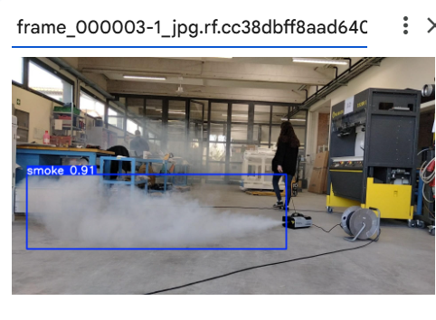
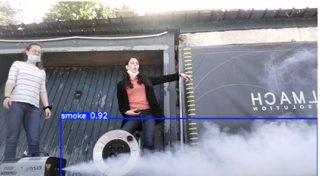
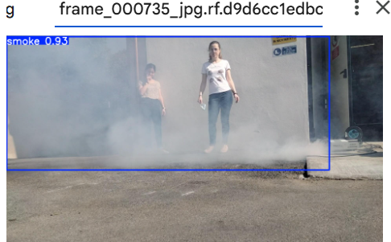
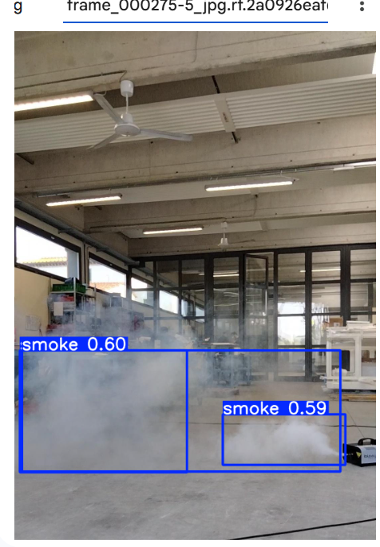

# 🔥 Smoke Detection using YOLOv11

A real-time smoke detection system built on **YOLOv11** (Ultralytics), trained to identify smoke in images and video frames using bounding box object detection. The model is designed for deployment across edge devices and cloud environments.

<p align="center">
  
</p>

---

## 📌 Overview

Traditional smoke detectors rely on physical particle sensing, which makes them prone to false alarms and unable to provide spatial context about where smoke is occurring. This project explores a **computer vision-based approach** — using a fine-tuned YOLOv11 model to detect smoke in real time from camera feeds or static images.

Potential use cases include:
- Industrial facility monitoring
- Smart home safety systems
- Warehouse and garage surveillance
- Integration with automated alert or suppression systems

---

## ✅ Best Results

| Metric | Value |
|---|---|
| Model | YOLOv11n (nano) |
| Dataset | smoke.v2-release (YOLOv11 format) |
| Image Size | 640×640 |
| Epochs | 50 (patience = 20) |
| Batch Size | 16 |
| mAP@0.5 | *tracked per epoch* |
| mAP@0.5:0.95 | *best epoch selected via fitness score* |

> **Fitness Score** is calculated as: `0.1 × mAP@0.5 + 0.9 × mAP@0.5:0.95`
> The best-performing epoch's weights (`best.pt`) are used for inference.

---

## 🖼️ Sample Detections

<p align="center">
  
  
</p>
<p align="center">
  
</p>

*Detections shown with bounding boxes and confidence scores (e.g., `smoke 0.92`, `smoke 0.91`)*

---

## 🗂️ Project Structure

```
smoke-detection/
│
├── SmokeDetection.ipynb          # Main training & inference notebook
├── data.yaml                     # Dataset config (classes, paths)
├── smoke.v2-release.yolov11.zip  # Dataset archive (YOLOv11 format)
│
├── runs/
│   └── detect/
│       └── train/
│           ├── weights/
│           │   ├── best.pt       # Best model weights
│           │   └── last.pt       # Last epoch weights
│           └── results.csv       # Training metrics per epoch
│
└── README.md
```

---

## ⚙️ Setup & Installation

### Prerequisites
- Python 3.8+
- Google Colab (recommended) or a local GPU environment

### Install Dependencies

```bash
pip install ultralytics
```

### Mount Drive & Prepare Data (Colab)

```python
from google.colab import drive
drive.mount('/content/drive')

# Unzip dataset
!unzip /content/smoke.v2-release.yolov11.zip -d /content
```

---

## 🚀 Training

```python
from ultralytics import YOLO

# Load base model
model = YOLO("yolo11n.pt")

# Train
model.train(
    data="data.yaml",
    epochs=50,
    imgsz=640,
    batch=16,
    patience=20
)
```

Training automatically stops early if no improvement is observed for 20 consecutive epochs (`patience=20`).

---

## 🔍 Inference

### Run predictions on test images

```python
# Using the best saved weights
best_model = YOLO("runs/detect/train/weights/best.pt")

best_model.predict(
    source="test/images",
    save=True
)
```

Predictions are saved to `runs/detect/predict/`.

---

## 📊 Evaluating Training Results

```python
import pandas as pd

results = pd.read_csv("runs/detect/train/results.csv", skipinitialspace=True)

# Compute YOLO fitness score
map50     = results.iloc[:, 6]   # mAP@0.5
map50_95  = results.iloc[:, 7]   # mAP@0.5:0.95
fitness   = (0.1 * map50) + (0.9 * map50_95)

best_epoch = fitness.idxmax() + 1
print(f"Best Epoch       : {best_epoch}")
print(f"Fitness Score    : {fitness.max():.4f}")
print(f"mAP@0.5:0.95     : {map50_95.iloc[fitness.idxmax()]:.4f}")
```

---

## 📦 Model Export

The trained model can be exported for edge and mobile deployment:

```python
model.export(format="onnx")    # For cross-platform inference
model.export(format="tflite")  # For mobile / Raspberry Pi deployment
```

| Format | Target Platform |
|---|---|
| `.pt` (PyTorch) | Server / Colab |
| `.onnx` | Cross-platform, NVIDIA, Intel |
| `.tflite` | Android, Raspberry Pi, edge devices |

---

## 📐 ML Metrics Reference

| Metric | Description |
|---|---|
| **Precision** | `TP / (TP + FP)` — what % of detections are correct |
| **Recall** | `TP / (TP + FN)` — what % of true positives are captured |
| **mAP@0.5** | Mean Average Precision at 50% IoU threshold |
| **mAP@0.5:0.95** | Mean AP across IoU thresholds from 0.50 to 0.95 (primary metric) |
| **Fitness** | `0.1 × mAP@0.5 + 0.9 × mAP@0.5:0.95` — YOLO's composite score |

---

## 🧠 Motivation & Challenges

Vision-based smoke detection complements traditional detectors by providing **spatial localization** of smoke — telling you *where* it is, not just *that* it exists. This enables smarter automated responses (targeted sprinklers, drone dispatch, alerts with location metadata).

**Key challenges addressed:**
- Detecting smoke at varying densities and lighting conditions
- Distinguishing smoke from steam, fog, or dust
- Handling multiple simultaneous smoke sources in a single frame
- Balancing model accuracy vs. inference speed for edge deployment

---

## 🔭 Future Work

- [ ] Train on a larger, more diverse dataset (outdoor, wildfire, vehicle smoke)
- [ ] Combine smoke + fire detection in a single multi-class model
- [ ] Real-time video stream inference using webcam or RTSP feed
- [ ] Deploy to edge hardware (Jetson Nano, Raspberry Pi) via TFLite/ONNX
- [ ] Explore segmentation for pixel-level smoke mapping
- [ ] Evaluate thermal + RGB fusion to reduce false positives

---

## 📚 References & Related Work

- [Ultralytics YOLOv11 Documentation](https://docs.ultralytics.com/)
- [Roboflow Wildfire Smoke Detection Dataset](https://public.roboflow.com/object-detection/wildfire-smoke)
- [YOLOv5 Wildfire Smoke Detection — W&B Report](https://wandb.ai/ivangoncharov/yolov5-roboflow-wandb/reports/)
- [Fire and Smoke Detection with Keras — PyImageSearch](https://www.pyimagesearch.com/2019/11/18/fire-and-smoke-detection-with-keras-and-deep-learning/)
- [Yolov5-Fire-Detection (spacewalk01)](https://github.com/spacewalk01/Yolov5-Fire-Detection)
- [DFireDataset — Fire & Smoke Image Dataset](https://github.com/gaiasd/DFireDataset)

---

## 🛠️ Tech Stack


---
